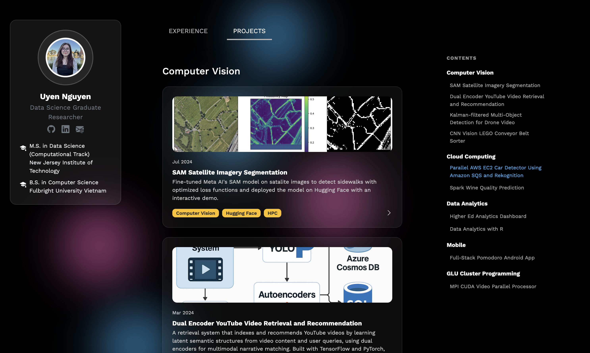

# Portfolio Website

A modern, responsive portfolio website showcasing my experience in AI engineering, computer vision, and data analytics.

### 🌐 Live Site
Check out my website here at https://uyenguyen.com

## 🛠️ Tech Stack

**Frontend:**
- React 19 with Vite
- Bootstrap 5 for responsive design
- CSS3 with custom animations

**Development & Deployment:**
- Vite for fast development and building
- ESLint for code quality
- GitHub Pages for deployment

## 📱 UI Progress

**Current Design (August 2025)**

**Previous Version (May 2025)**

---
**Project Portfolio Website**
  *by Uyen Nguyen*
